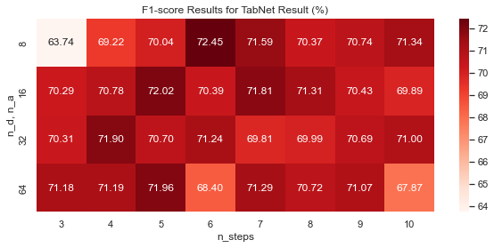
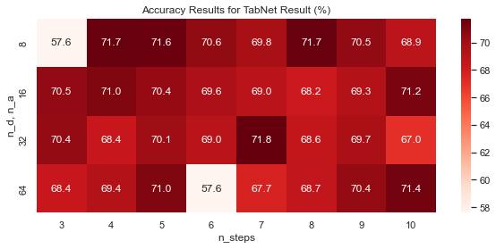

# Financial Scoring Model (#30)
This project is 1st selection of proposed projects from Neural Networks and Applications (XAI606) 2021 Fall.

## Project Description

### Dataset: HELOC

**HELOC**, Home Equity Line Of Credit, dataset consist of borrower's past transaction, inquires and other states and their success/failure of lending loans.
+ `ExternalRiskEstimate` - consolidated indicator of risk markers (equivalent of polish BIK’s rate)
+ `MSinceOldestTradeOpen` - number of months that have elapsed since first trade
+ `MSinceMostRecentTradeOpen` - number of months that have elapsed since last opened trade
+ `AverageMInFile` - average months in file
+ `NumSatisfactoryTrades` - number of satisfactory trades
+ `NumTrades60Ever2DerogPubRec` - number of trades which are more than 60 past due
+ `NumTrades90Ever2DerogPubRec` - number of trades which are more than 90 past due
+ `PercentTradesNeverDelq` - percent of trades, that were not delinquent
+ `MSinceMostRecentDelq` - number of months that have elapsed since last delinquent trade
+ `MaxDelq2PublicRecLast12M` - the longest delinquency period in last 12 months
+ `MaxDelqEver` - the longest delinquency period
+ `NumTotalTrades` - total number of trades
+ `NumTradesOpeninLast12M` - number of trades opened in last 12 months
+ `PercentInstallTrades` - percent of installments trades
+ `MSinceMostRecentInqexcl7days` - months since last inquiry (excluding last 7 days)
+ `NumInqLast6M` - number of inquiries in last 6 months
+ `NumInqLast6Mexcl7days` - number of inquiries in last 6 months (excluding last 7 days)
+ `NetFractionRevolvingBurden` - revolving balance divided by credit limit
+ `NetFractionInstallBurden` - installment balance divided by original loan amount
+ `NumRevolvingTradesWBalance` - number of revolving trades with balance
+ `NumInstallTradesWBalance` - number of installment trades with balance
+ `NumBank2NatlTradesWHighUtilization` - number of trades with high utilization ratio (credit utilization ratio - the amount of a credit card balance compared to the credit limit)
+ `PercentTradesWBalance` - percent of trades with balance

### Task & Goal
There are 2 aims for this.
1. Improve performance.
   + Proposal baseline has 70.77% in F1, 73% in Accuracy

2. Find features which best explains the model

## Proposed Methods

### 1. Improving Performance
1. Tree-based Classifiers
   + Find the best classifier with TPOT
   + Other AutoML libraries to reduce labouring cost

2. Neural Networks
   
   I also tried deep neural networks, since the proposal insisted that deep learning models does not have enoguth interpretability nor satisfying performance from them. However, from [this survey](https://arxiv.org/pdf/2110.01889.pdf) one point out that there are numerous deep learning architectures proposed to deal with tabular data, even with explainability. Models below are the models that are widely used in the tabular data. I have only used **TabNet** in this project.
   + [**TabNet**](https://arxiv.org/pdf/1908.07442.pdf) [Code Implementation](https://github.com/dreamquark-ai/tabnet)
   + [**Tab Transformer**](https://arxiv.org/pdf/2012.06678.pdf) [Code Implementation](https://github.com/lucidrains/tab-transformer-pytorch)
   + [**SAINT**](https://arxiv.org/pdf/2106.01342.pdf) [Code Implementation](https://github.com/somepago/saint)

    Another reason for using deep neural networks is the feature. No features are directly related to the target label from the view. From the correlation map, one can also observe that there are many redundant features with each other. Take a look at the pairplot and correlation heatmap below (click to enlarge).
    
    
    For this reason, I here suggest that **non-linearity should come to play**.

### 2. Finding features
From [Yu Zhang](https://arxiv.org/pdf/2012.14261.pdf), interpretability of the neural networks are as follows.

Since this work tries to find a general trends in predicting the successful lending, I have focused on using passive and global method for inspecting the features. Since LIME and Shap are suitable for finding such interpretations, I have used these libraries to find the features that best explains this.

Furthermore, I add i.i.d. Gaussian noise to features one by one, which is example of a perturbation method, and find the feature that disrupts performance the most.

## Results
### Tree-based Classifiers
Through TPOT, we got the best model of XGBoost with on my train/dev split with 68% F1-score on dev.

### TabNet

In **TabNet**, one can give variations of parameters in number of dimensions, attentions and steps. Here I have manually searched the best parameters with F1-score and accuracy. The results are shown belown.

I have used the best F1-score which is (`n_d=n_a=32`, `n_steps=7`)